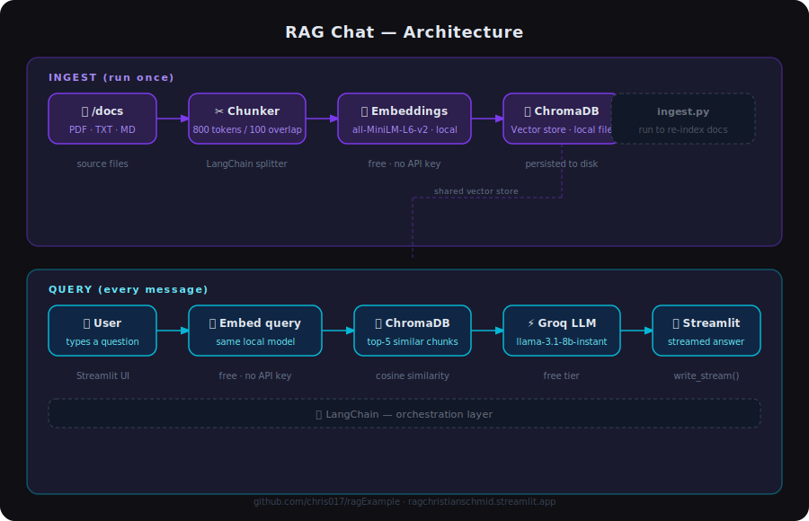

# RAG Chat — Ask Your Own Documents

A Retrieval-Augmented Generation (RAG) app that lets you chat with your own files. Drop any PDFs, text, or markdown files into `/docs`, index them once, and ask questions in a chat UI — the model answers using only what's in your documents.

Built as a showcase of how RAG works in practice using entirely free tools.

---

## Live demo

> Ask questions about Christian Schmid's CV — try it at [ragchristianschmid.streamlit.app](https://ragchristianschmid.streamlit.app)



---

## How it works

```
┌─────────────────────────────────────────────────────┐
│  INGEST  (run once)                                 │
│                                                     │
│  /docs/*.pdf / *.txt / *.md                         │
│       │                                             │
│       ▼                                             │
│  Split into chunks (800 tokens, 100 overlap)        │
│       │                                             │
│       ▼                                             │
│  Embed with all-MiniLM-L6-v2  (local, free)         │
│       │                                             │
│       ▼                                             │
│  Store vectors in ChromaDB  (local file)            │
└─────────────────────────────────────────────────────┘

┌─────────────────────────────────────────────────────┐
│  QUERY  (every message)                             │
│                                                     │
│  User question                                      │
│       │                                             │
│       ▼                                             │
│  Embed question  (same local model)                 │
│       │                                             │
│       ▼                                             │
│  Retrieve top-5 most similar chunks from ChromaDB  │
│       │                                             │
│       ▼                                             │
│  Send chunks + question to Groq LLM                │
│       │                                             │
│       ▼                                             │
│  Stream answer back to the user                     │
└─────────────────────────────────────────────────────┘
```

The key idea: the LLM never sees your full documents — only the few chunks most relevant to each question. This keeps responses focused and works even with large document collections.

---

## Stack

| Layer | Tool | Cost |
|---|---|---|
| LLM | [Groq](https://groq.com) — `llama-3.1-8b-instant` | Free tier |
| Embeddings | [sentence-transformers/all-MiniLM-L6-v2](https://huggingface.co/sentence-transformers/all-MiniLM-L6-v2) | Free, runs locally |
| Vector store | [ChromaDB](https://www.trychroma.com) | Free, local file |
| Orchestration | [LangChain](https://langchain.com) | Free, open source |
| UI | [Streamlit](https://streamlit.io) | Free |

---

## Run it yourself

### 1. Clone & set up environment

```bash
git clone https://github.com/your-username/ragFineTune.git
cd ragFineTune

python -m venv venv
source venv/bin/activate      # Windows: venv\Scripts\activate
pip install -r requirements.txt
```

### 2. Get a free Groq API key

Sign up at [console.groq.com](https://console.groq.com) — no credit card required.

```bash
cp .env.example .env
# open .env and add your key:
# GROQ_API_KEY=gsk_...
```

### 3. Add your documents

Drop any `.pdf`, `.txt`, or `.md` files into the `/docs` folder.

### 4. Index your documents

```bash
python ingest.py
```

This chunks your files, embeds them locally, and saves the vectors to `chroma_db/`. Run this again whenever you add new documents.

### 5. Start the app

```bash
streamlit run app.py
```

---

## Deploy to Streamlit Cloud

1. Push the repo to GitHub (the `chroma_db/` folder must be included)
2. Go to [share.streamlit.io](https://share.streamlit.io) and connect your repo
3. Set main file to `app.py`
4. Under **Settings → Secrets**, add:

```toml
GROQ_API_KEY = "gsk_..."
```

---

## Adapting this for your own use case

1. **Swap the documents** — replace the files in `/docs` with your own (company docs, notes, a book, anything)
2. **Change the LLM** — swap `ChatGroq` in `app.py` for any LangChain-compatible LLM (`ChatOpenAI`, `ChatAnthropic`, `ChatOllama` for local, etc.)
3. **Tune chunk size** — in `ingest.py`, adjust `chunk_size` and `chunk_overlap` to fit your content (smaller chunks = more precise retrieval, larger = more context per chunk)
4. **Change TOP_K** — in `app.py`, `TOP_K` controls how many chunks are retrieved per question

---

## Project structure

```
ragFineTune/
├── docs/               # Your source documents go here
├── chroma_db/          # Auto-generated vector store (committed for deployment)
├── ingest.py           # Index documents into ChromaDB
├── app.py              # Streamlit chat app
├── inspect_db.ipynb    # Jupyter notebook to inspect stored chunks
├── requirements.txt
├── .env.example
└── .streamlit/
    └── config.toml     # Streamlit theme config
```
